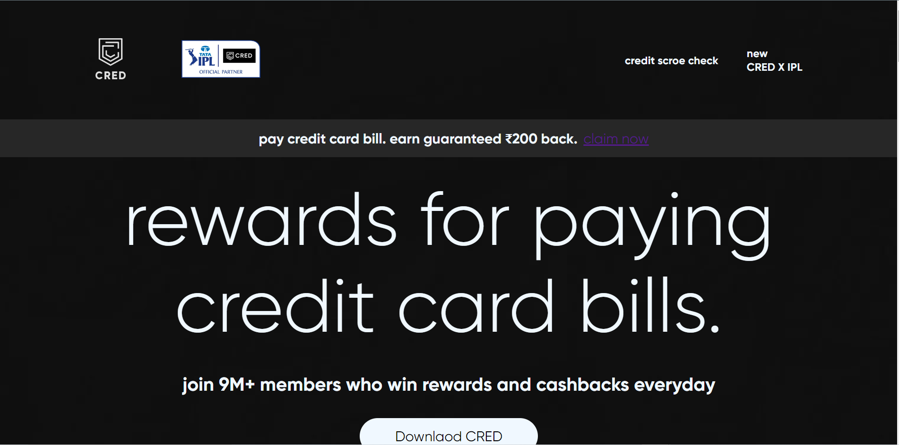
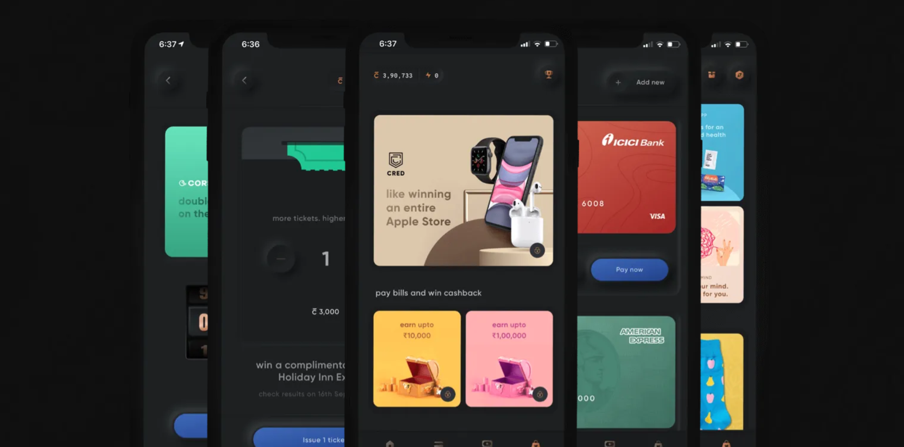
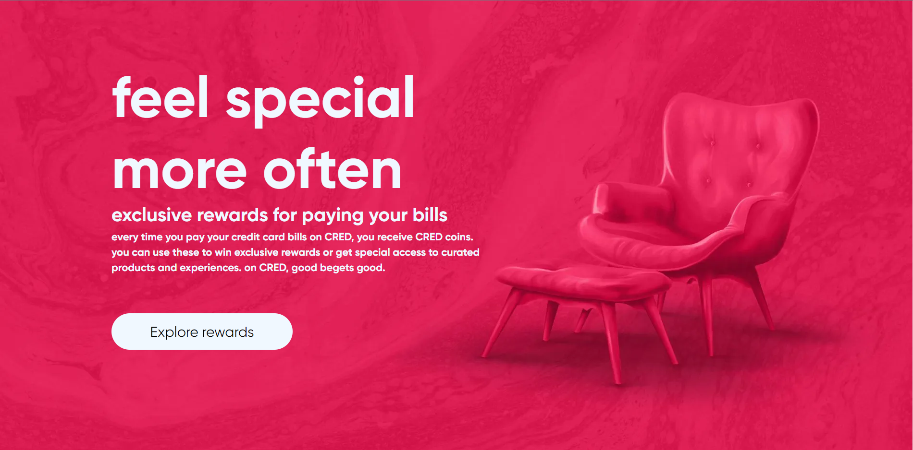
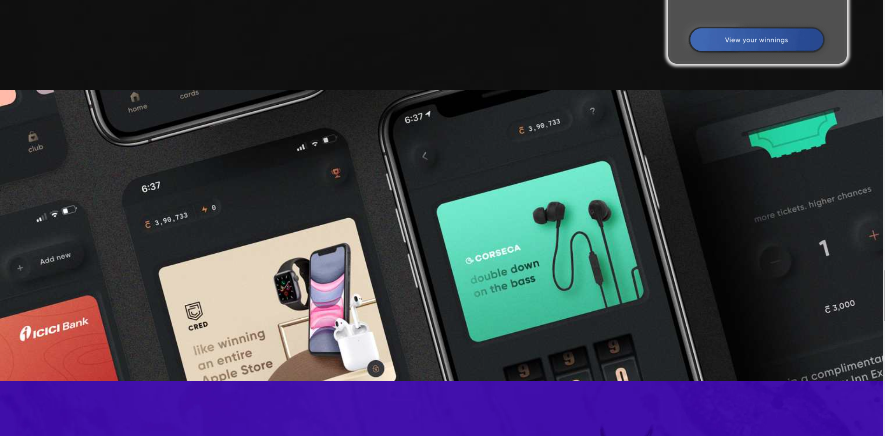

 

# I'm Sandeep Pal

> This is my first assignment in frontend  with the pure <mark >HTML and CSS</mark> .

## Learning 

In this project learn a lot like

- Position
-Flex 
-parrlax Effec
-Background Image Place
many more

## Use Z-index

## Use Parrallelx Effect

## TIME ON THE PROJECT 🕓

✔️10 HOUR 

## About More

	⚠️ This Project not Responsive so 📱 Mobile user cant seen exactly how site looking but i am working on it to make it responsive 
  🔴 [live preview](https://credclone-sandeeppal.netlify.app/)

👀

 > 

